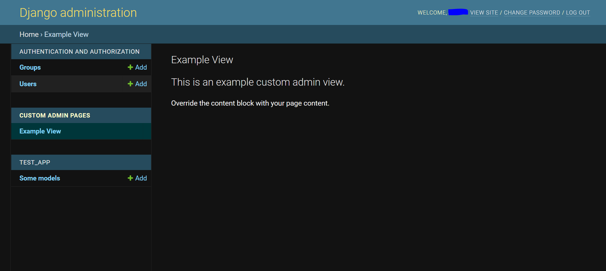

Django Custom Admin Pages
===================================

**Django Custom Admin Pages** A django app that lets you add standard class-based views 
to the django admin index and navigation. Create a view, register it like you would a 
ModelAdmin, and it appears in the Django Admin Nav.

Check out the :doc:`usage` section for further information, including
how to :ref:`installation` the project.

Contents
--------

.. toctree::

   usage
   api
